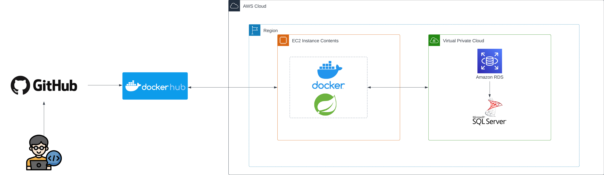

# Java levelup - Beanhub
Beanhub is a platform where bean enthusiasts can share bean-related recipes with one-another.

## AWS Setup
AWS and our github workflows are set up in the following way:


## To run the API
```cmd
cd api
./gradlew
./gradlew bootRun
```

## To run the Client
```cmd
cd BeanHub.Client
./gradlew
./gradlew --console=plain app:run   
```

If you get a complaint about a client ID, you must set the client ID. You may also need to set the API url.
To make this a bit easier, add a `setenv.ps1` file in the `BeanHub.Client` directory, with this content:
```
$env:BEANHUB_CLIENT_ID = "<yourCLientID>"
$env:BEANHUB_API_URL = "<API URL>"
```
This info is likely confidential, **SO DO NOT COMMIT IT!!!**

## auth.tfvars
```hcl
access_key = "YOUR_ACCESS_KEY_HERE"
secret_key = "YOUR_SECRET_KEY_HERE"
db_password = "YOUR_DB_PASSWORD"
db_username = "YOUR_DB_USERNAME"
```

## Apply terraform
```cli
terraform apply -var-file="auth.tfvars"
```

## Destroy terraform
```cli
terraform destroy -var-file="auth.tfvars"
```

## Flyway and database migrations
**VERY IMPORTANT:**
- When you add a SQL script, make sure that you place it in the SQL folder, else flywya will ignore it.
- Name your script like this: `VYYYYMMDDHHmm__<ScriptName>.sql` (The dateTime accurate to the minute, 2 underscores and your script's name)


Make sure that these are valid in github secrets:
- DB_BUILD_USERNAME
- DB_BUILD_PASSWORD
- DB_BUILD_URL
Now make a `flyway.toml` file:
```toml
[flyway]
locations = ["filesystem:SQL"]

 
[environments.default]
locations = ["filesystem:SQL"]
```
Then add this 'flyway.yml' to the `.github/workflows` folder:
```yml
name: "Database CI/CD"
 
on:
  
  pull_request:
    types:
      - closed
    branches:
      - main
      
 
jobs:
  Migrate:
    if: github.event.pull_request.merged == true
    name: RunMigration
    runs-on: ubuntu-20.04         
    steps:
      - name: RunMigration
        uses: actions/checkout@v3.0.0
      - run: wget -qO- https://download.red-gate.com/maven/release/com/redgate/flyway/flyway-commandline/10.7.1/flyway-commandline-10.7.1-linux-x64.tar.gz | tar -xvz && sudo ln -s `pwd`/flyway-10.7.1/flyway /usr/local/bin
      - run: flyway -user="${{ secrets.DB_BUILD_USERNAME }}" -password="${{ secrets.DB_BUILD_PASSWORD }}" -url="${{ secrets.DB_BUILD_URL }}" info
      - run: flyway -user="${{ secrets.DB_BUILD_USERNAME }}" -password="${{ secrets.DB_BUILD_PASSWORD }}" -url="${{ secrets.DB_BUILD_URL }}" migrate
```
- This will only run when a PR is approved and merged into main, so **MAKE SURE THAT YOUR SQL IS CORRECT BEFORE MAKING OR APPROVING A PR!!!**

